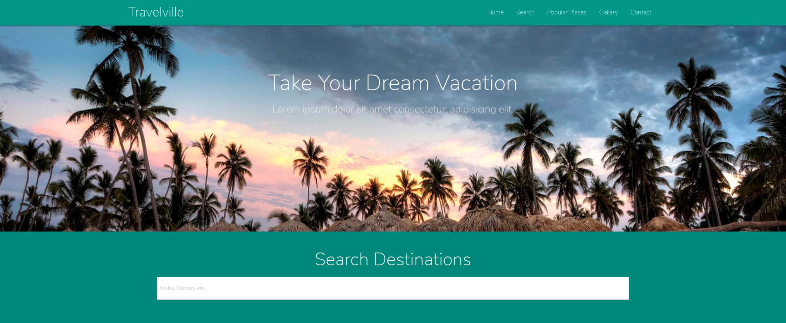

# Travel Agency Theme
This is a theme created on Traversy Media youtube channel.
https://www.youtube.com/watch?v=MaP3vO-vEsg

## Table of contents

- [Overview](#overview)
- [Screenshot](#screenshot)
- [Links](#links)
- [My process](#my-process)
  - [Built with](#built-with)
  - [What I learned](#what-i-learned)
- [Acknowledgments](#acknowledgments)

## Overview
Create a Travel Agency Theme using Materialize CSS

### Screenshot

### Links

- Live Site URL: https://rhulog.github.io/travel-agency-theme/

## My process
I watched Brad (Traversy Media) create his site and followed along. This was a practice site to hone in on Materialize CSS.

### Built with

- Semantic HTML5 markup
- CSS custom properties
- Materialize CSS
- Font Awesome (https://use.fontawesome.com/releases/v5.0.13/css/all.css)
- Google Icon Fonts (https://fonts.googleapis.com/icon?family=Material+Icons)
- jQuery(https://code.jquery.com/jquery-3.3.1.min.js)

### What I learned

I've been trying to learn the CSS framework Materialize so creating a site with it helped a lot. Also, Brad's way of creating markup was really useful to learn from. I'll probably be using his style of markup from this point on.

## Acknowledgments

Would love to thank Brad (Traversy Media) for putting out such amazing content for everyboody to learn from. 
